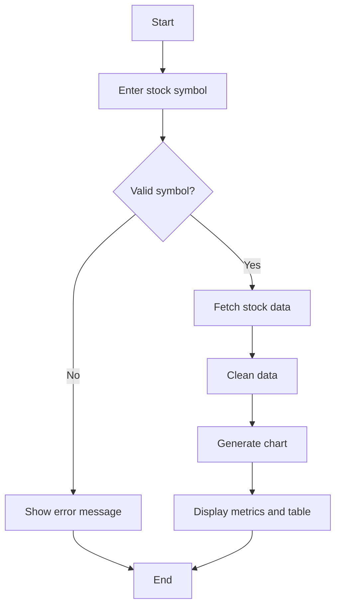

```mermaid
flowchart TD
    A[Start] --> B[Enter stock symbol]
    B --> C{Valid symbol?}
    C -->|No| D[Show error message]
    D --> Z[End]
    C -->|Yes| E[Fetch stock data]
    E --> F[Clean data]
    F --> G[Generate chart]
    G --> H[Display metrics and table]
    H --> Z[End]
```
