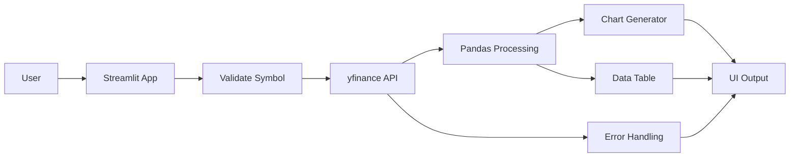

```mermaid
flowchart LR
    U[User] --> S[Streamlit App]
    S --> V[Validate Symbol]
    V --> A[yfinance API]
    A --> P[Pandas Processing]
    P --> C[Chart Generator]
    P --> D[Data Table]
    C --> O[UI Output]
    D --> O
    A --> E[Error Handling]
    E --> O
```
