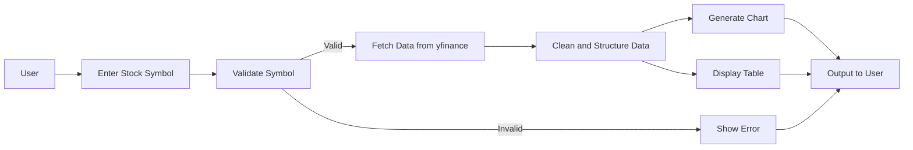

```mermaid
flowchart LR
    U[User] --> P1[Enter Stock Symbol]
    P1 --> P2[Validate Symbol]
    P2 -->|Valid| P3[Fetch Data from yfinance]
    P2 -->|Invalid| P7[Show Error]
    P3 --> P4[Clean and Structure Data]
    P4 --> P5[Generate Chart]
    P4 --> P6[Display Table]
    P5 --> O[Output to User]
    P6 --> O
    P7 --> O
```
