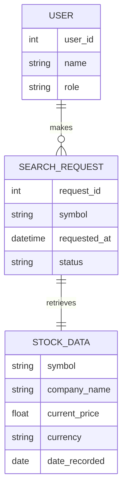

```mermaid
erDiagram
    USER ||--o{ SEARCH_REQUEST : makes
    SEARCH_REQUEST ||--|| STOCK_DATA : retrieves
    STOCK_DATA {
        string symbol
        string company_name
        float current_price
        string currency
        date date_recorded
    }
    SEARCH_REQUEST {
        int request_id
        string symbol
        datetime requested_at
        string status
    }
    USER {
        int user_id
        string name
        string role
    }
```
