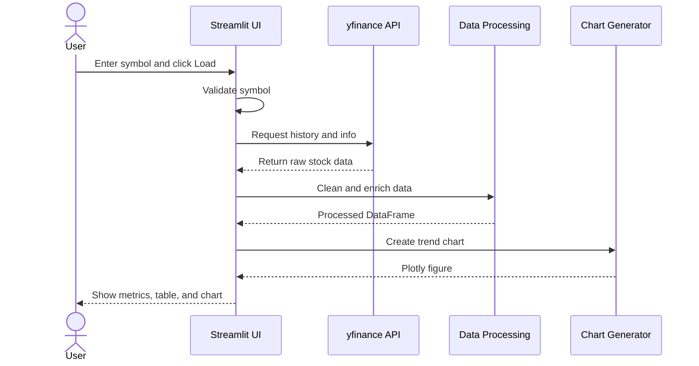

```mermaid
sequenceDiagram
    actor User
    participant UI as Streamlit UI
    participant API as yfinance API
    participant PROC as Data Processing
    participant CHART as Chart Generator

    User->>UI: Enter symbol and click Load
    UI->>UI: Validate symbol
    UI->>API: Request history and info
    API-->>UI: Return raw stock data
    UI->>PROC: Clean and enrich data
    PROC-->>UI: Processed DataFrame
    UI->>CHART: Create trend chart
    CHART-->>UI: Plotly figure
    UI-->>User: Show metrics, table, and chart
```
